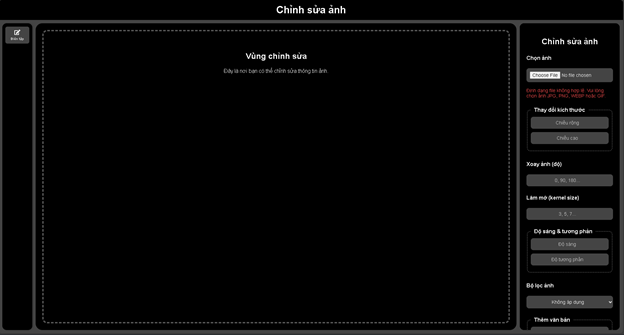
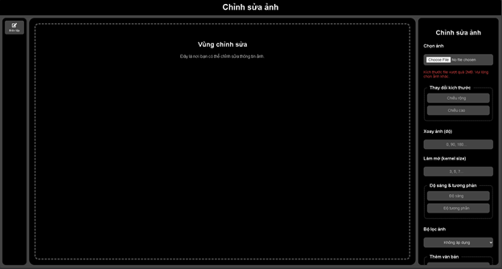
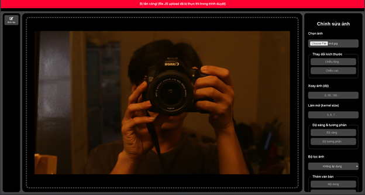

Đề tài báo cáo: Bảo mật dữ liệu tải lên
** Website chỉnh sửa ảnh đơn giản **

Các thành viên trong nhóm:
| Họ và tên            | MSV           | Nội dung thực hiện                              |
|----------------------|---------------|-------------------------------------------------|
| Đặng Anh Tài         | 22810310385   |       |
| Lương Anh Quân       | 22810310380   |         |

Hướng dẫn sử dụng:

TH1: Chọn file đúng định dạng và đúng kích thước file ( ví dụ: file .jpg và kích thước 104kb )

TH2: Chọn sai định dạng file

TH3: Chọn sai kích thước file

TH4: Demo tấn công bằng file ảnh có chứa mã độc
Để biết file ảnh có mã độc hay không, bên client/eidtForm.js. Chúng em có thêm phần đọc file kiểm tra xem có mã độc ẩn bên trong không
Khi đó file ảnh chứa mã độc sẽ được thực thi ngay từ phần front-end

